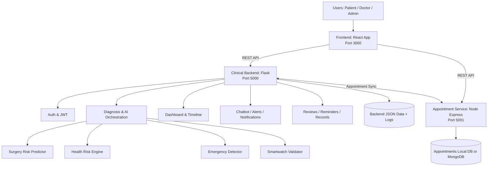
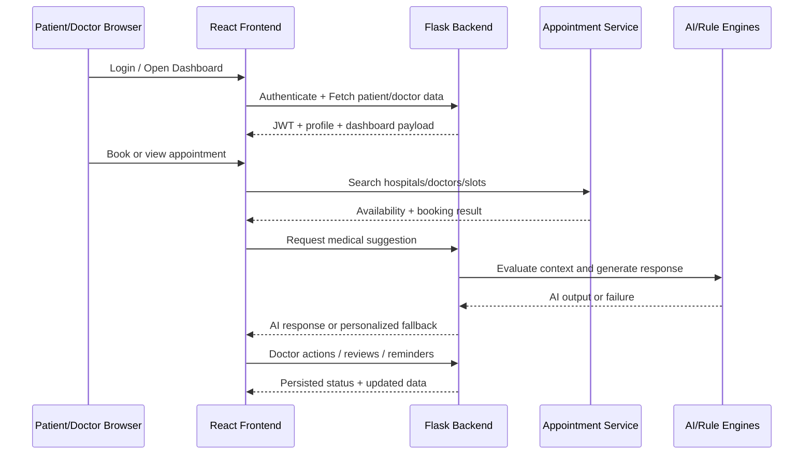
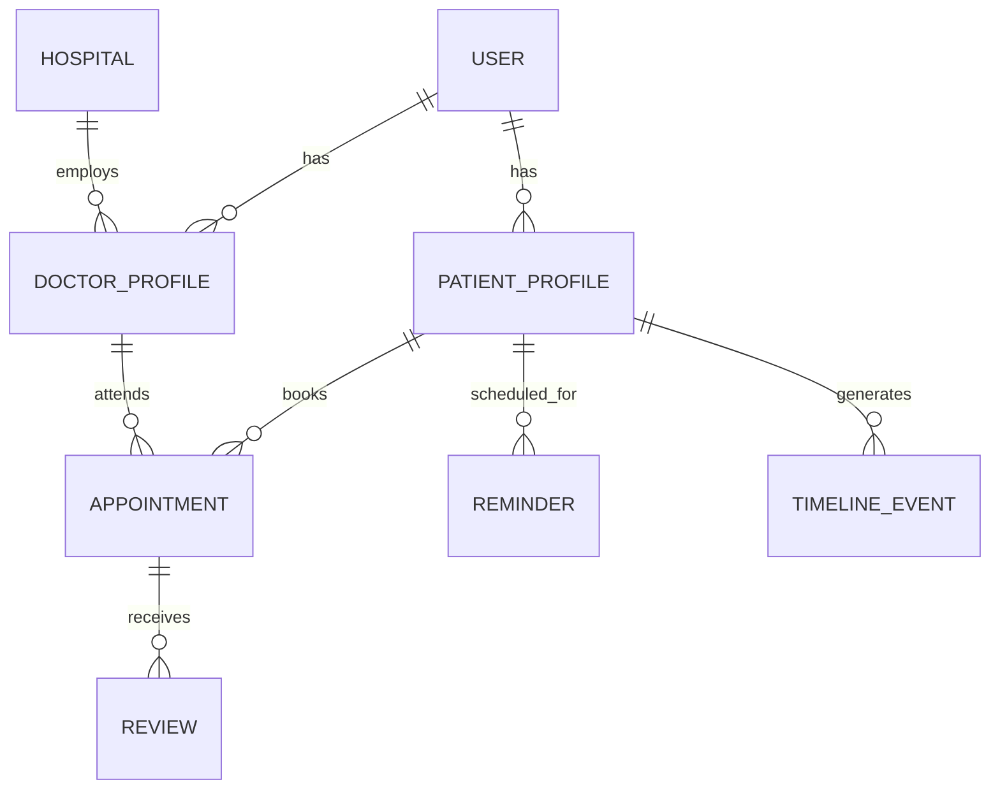

# AI Smart Hospital Assistant - Complete Project Documentation


## Table of Contents
1. Abstract
2. Introduction
   2.1 Background
   2.2 Motivation
   2.3 Objectives
3. Problem Statement
4. Literature Review / Existing Systems
   4.1 Existing Solutions
   4.2 Limitations of Existing Systems
5. Proposed System
   5.1 Overview
   5.2 Unique Features / Innovations
6. System Architecture
   6.1 Architecture Diagram
   6.2 Modules Description
7. Technologies Used
   7.1 Software Requirements
   7.2 Hardware Requirements
8. Methodology / Working Process
   8.1 Data Flow
   8.2 Algorithms / Models Used
9. Implementation
   9.1 Frontend Development
   9.2 Backend Development
   9.3 Database Design
10. Results and Discussion
   10.1 Output Screens
   10.2 Performance Analysis
11. Advantages of the System
12. Limitations of the System
13. Applications
14. Future Scope
15. Conclusion
16. References
17. Appendices
   17.1 Code Snippets
   17.2 User Manual

---

## 1. Abstract
Smart Hospital Assistant is a full-stack healthcare platform that supports patient monitoring, intelligent triage, surgery risk prediction, hospital appointment management, and doctor-centric operational dashboards. The solution integrates a React frontend, a Flask-based clinical backend, and a dedicated Node.js appointment microservice. The system is designed for practical deployment in clinics and hospitals where real-time decision support, appointment synchronization, and resilient AI-assisted guidance are required.

This documentation presents the complete project architecture, process flow, technology stack, implementation strategy, and outcomes. The current deployment intentionally excludes pain detection and voice analysis and focuses on active, production-relevant capabilities such as surgery risk analysis, emergency detection, health risk scoring, personalized chatbot guidance, reviews, reminders, and appointment coordination.

## 2. Introduction
Healthcare workflows often involve fragmented data systems, delayed communication, and inconsistent follow-up between patients, doctors, and hospital operations. Smart Hospital Assistant addresses this challenge by combining clinical intelligence and workflow automation in one platform.

### 2.1 Background
Traditional hospital systems separate EMR records, booking services, and patient communication. Clinicians must manually switch contexts, increasing delay and cognitive load. At the same time, patients need continuous and easy access to guidance between visits.

### 2.2 Motivation
The project is motivated by five practical needs:
- Faster doctor decision support through unified dashboards.
- Better patient engagement via guided chatbot interactions.
- Integrated appointment lifecycle visibility across services.
- Real-time detection of risk and escalation conditions.
- Simple deployment for low-resource and local environments.

### 2.3 Objectives
- Build a modular full-stack healthcare platform with clear service boundaries.
- Provide AI-assisted risk analysis using active models only.
- Enable seamless integration between doctor workflow and appointment service.
- Maintain reliability during external AI outages using fallback responses.
- Deliver secure role-based access and auditable operations.

## 3. Problem Statement
Hospitals and clinics need a reliable system that can combine patient data, risk estimation, doctor workflow actions, and appointments in one operational view. Existing fragmented solutions create delayed interventions, lower patient adherence, and inefficient coordination. The problem is to design and implement an integrated, scalable, and resilient digital healthcare assistant that supports clinical workflows while remaining practical for local and production environments.

## 4. Literature Review / Existing Systems
### 4.1 Existing Solutions
Current healthcare software categories include:
- EMR/EHR systems for patient records.
- Appointment booking portals for scheduling.
- Telemedicine apps for virtual consultations.
- Point AI tools for symptom checking or prediction.

### 4.2 Limitations of Existing Systems
- Limited interoperability between clinical records and booking engines.
- AI outputs often isolated from day-to-day doctor workflow.
- Weak fallback behavior when cloud AI services are unavailable.
- Incomplete real-time monitoring and escalation routing.
- Low visibility into doctor-level operations and hospital activity trends.

## 5. Proposed System
### 5.1 Overview
The proposed solution is a three-layer architecture:
- Frontend web application for patients and doctors.
- Clinical backend API for authentication, AI logic, timeline, alerts, and records.
- Appointment microservice for hospital-doctor slot management and booking.

### 5.2 Unique Features / Innovations
- Integrated doctor dashboard with hospital activity insights and appointment status normalization.
- AI-assisted medical suggestion endpoint with personalized fallback strategy.
- Combined surgery risk, health risk, smartwatch validation, and emergency detection.
- Review and reminder modules integrated into the same clinical workflow.
- Local lightweight appointment storage fallback without mandatory MongoDB.

## 6. System Architecture
### 6.1 Architecture Diagram


### 6.2 Modules Description
1. Frontend Module (React)
- Handles routing for home, login, surgery risk, doctor dashboard, and patient dashboard.
- Presents analytics, hospital activity, appointments, and chatbot interactions.
- Connects to both Flask backend and appointment microservice.

2. Authentication Module
- JWT-based login and role-aware access behavior.
- Maintains secure user session for doctor and patient workflows.

3. Diagnosis and AI Module
- Runs active decision pipeline for surgery risk and health/risk signals.
- Uses AI decision engine to convert model outputs into alert priorities.
- Explicitly excludes pain detection and voice analysis in current deployment.

4. Chatbot and Recommendation Module
- Provides health guidance and query response.
- Uses patient context to generate personalized fallback suggestions when external AI is unavailable.

5. Doctor Dashboard Module
- Displays patient metrics, trends, and action items.
- Includes hospital activity insights and synchronized appointment statuses.

6. Appointment Module (Microservice)
- Manages hospitals, doctors, slots, and booking operations.
- Supports local JSON persistence when MongoDB is unavailable.

7. Records, Reviews, and Reminder Module
- Enables clinician documentation and patient feedback flows.
- Supports review helpfulness and doctor rating endpoints.

8. Logging and Audit Module
- Stores structured JSONL logs for events and diagnostics.
- Supports traceability for critical healthcare actions.

## 7. Technologies Used
### 7.1 Software Requirements
Frontend:
- React.js 18+
- React Router v6
- Tailwind CSS

Backend:
- Python 3.11
- Flask 3.x
- Flask-CORS
- PyJWT
- Scikit-learn
- NumPy

Appointment Service:
- Node.js 18+
- Express.js
- Optional MongoDB

Tools and Platform:
- npm
- pip / virtual environment
- Git
- Postman / browser-based API testing

### 7.2 Hardware Requirements
Minimum:
- CPU: Dual-core 2.0 GHz
- RAM: 4 GB
- Storage: 2 GB free
- OS: Windows/Linux/macOS

Recommended:
- CPU: Quad-core 2.5 GHz+
- RAM: 8 GB+
- Storage: SSD with 5 GB free
- Stable internet for external AI integrations

## 8. Methodology / Working Process
### 8.1 Data Flow


### 8.2 Algorithms / Models Used
1. Surgery Risk Prediction
- Model class: Gradient Boosting Classifier.
- Inputs include age, blood pressure, heart rate, BMI-like factors, and comorbidity indicators.
- Output categories: low, medium, high risk with confidence-linked recommendations.

2. Health Risk Engine
- Aggregates vitals and contextual health signals into actionable risk levels.
- Feeds dashboard alerting and trend interpretation.

3. Emergency Detector
- Rule-based and threshold-based critical event checks.
- Escalates based on severity and urgency policy.

4. Smartwatch Validator
- Validates incoming wearable metrics before they are consumed by downstream modules.

Note: Pain detection and voice analysis are removed from the active system and are not part of this methodology.

## 9. Implementation
### 9.1 Frontend Development
- Developed as a component-driven React application.
- Role-aware dashboard behavior for doctor and patient views.
- Doctor dashboard includes Hospital Activity as primary operational area.
- Appointment status handling includes normalization for expired and removed entries.

### 9.2 Backend Development
- Flask application factory pattern with modular blueprints:
  - auth, diagnosis, dashboard, patients, alerts, timeline, doctor actions, notifications, emergency, logs, chatbot, appointments, reminders, reviews, records.
- CORS enabled for local frontend integration.
- Structured route design with consistent /api prefixes.
- Resilient chatbot endpoint with fallback strategy.

### 9.3 Database Design
Primary storage style:
- Backend clinical data: JSON files (patients, doctors, checkups) plus JSONL logs.
- Appointment service: MongoDB collections or local JSON fallback store.

Core entities:
- User (doctor/patient/admin)
- Patient profile and vitals
- Appointment (patient, doctor, hospital, date, status)
- Review and rating
- Reminder and notification
- Clinical logs and timeline events

Entity relationship summary:


## 10. Results and Discussion
### 10.1 Output Screens
Key output interfaces achieved:
- Home page with feature navigation.
- Doctor dashboard with hospital activity and synchronized appointments.
- Patient dashboard with chatbot and personalized suggestions.
- Surgery risk prediction form and result panel.
- Reviews and reminders workflow integrated into backend APIs.

### 10.2 Performance Analysis
Observed practical behavior in local multi-service execution:
- Stable parallel execution of frontend, backend, and appointment service.
- Correct route handling for reviews with preflight-compatible endpoints.
- Fallback medical suggestions returned even when external AI dependency is down.
- Appointment data synchronized to doctor dashboard with stale status correction.

Qualitative reliability indicators:
- High functional availability due to fallback patterns.
- Better operational clarity through module separation.
- Reduced workflow friction via integrated dashboard + booking views.

## 11. Advantages of the System
- Integrated clinical and operational view in one platform.
- Resilient behavior during external AI service degradation.
- Clear microservice boundary for appointments and hospital data.
- Practical local deployment path for development and demos.
- Extensible modular architecture for future healthcare features.

## 12. Limitations of the System
- JSON-file-backed backend storage is not ideal for large-scale production.
- Limited built-in analytics visualization for long-term historical cohorts.
- Requires careful API versioning as modules grow.
- Some advanced real-time messaging scenarios may need queue-based infrastructure.

## 13. Applications
- Multi-specialty clinic management dashboards.
- Hospital outpatient decision-support systems.
- Telehealth follow-up and chronic condition monitoring.
- Training/demo environments for digital healthcare workflows.

## 14. Future Scope
- Migration of backend data layer to managed relational or NoSQL database.
- Event-driven architecture for notifications and high-scale async workflows.
- Enhanced clinician explainability dashboards for model decisions.
- Multi-language support expansion and accessibility improvements.
- Integration with HL7/FHIR-compliant hospital systems.

## 15. Conclusion
Smart Hospital Assistant demonstrates how a modular full-stack architecture can unify patient engagement, clinical intelligence, and appointment operations in one coherent system. By integrating React, Flask, and a dedicated appointment microservice, the platform supports reliable healthcare workflows and practical deployment. The current implementation intentionally focuses on active clinical modules and excludes pain detection and voice analysis, resulting in a cleaner and maintainable solution aligned with present functional requirements.

## 16. References
1. Flask Official Documentation. https://flask.palletsprojects.com/
2. React Official Documentation. https://react.dev/
3. Express.js Documentation. https://expressjs.com/
4. Scikit-learn User Guide. https://scikit-learn.org/
5. JWT Introduction (RFC 7519). https://www.rfc-editor.org/rfc/rfc7519
6. Tailwind CSS Documentation. https://tailwindcss.com/docs

## 17. Appendices
### 17.1 Code Snippets
Snippet A - Flask blueprint registration pattern (summary):
```python
app.register_blueprint(auth_bp, url_prefix='/api/auth')
app.register_blueprint(diagnosis_bp, url_prefix='/api/diagnosis')
app.register_blueprint(reviews_bp, url_prefix='/api/reviews')
```

Snippet B - Appointment status normalization concept (summary):
```javascript
const computed = getComputedAppointmentStatus(appointment.date, appointment.status);
if (computed !== 'deleted') visibleAppointments.push({ ...appointment, status: computed });
```

Snippet C - Chatbot fallback response strategy (summary):
```python
if ai_unavailable:
    return personalized_fallback(patient_context)
```

### 17.2 User Manual
1. Start backend service (Flask).
2. Start appointment service (Node/Express).
3. Start frontend service (React).
4. Login as doctor or patient.
5. Patient flow:
- View dashboard.
- Request AI health suggestions.
- Book appointments.
- Check reminders and timeline updates.
6. Doctor flow:
- Open Doctor Dashboard (Hospital Activity default).
- Review synchronized appointments.
- View patient status and trend indicators.
- Manage reviews and follow-up actions.
7. Troubleshooting quick guide:
- If bookings do not appear, verify appointment service is running and reachable.
- If AI suggestion provider fails, system returns fallback guidance automatically.
- If review submission fails, verify API path is /api/reviews and CORS origins are configured.
